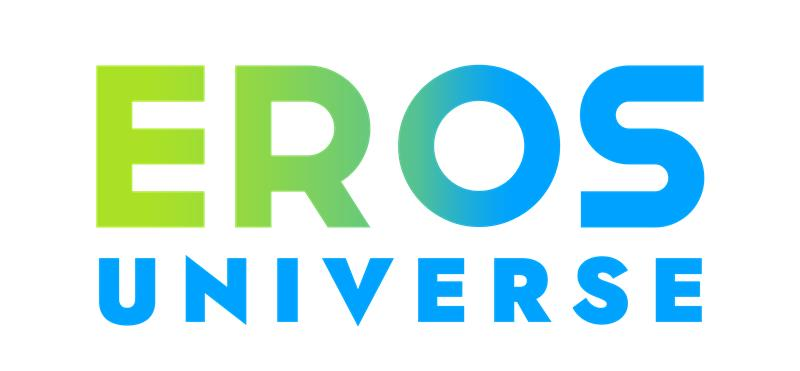

# EROS UNIVERSE - Motion Control Studio

AI-powered video generation platform using Kling AI's Motion Control API.



## 🚀 Quick Start

### Prerequisites
- Node.js (v16 or higher)
- npm or yarn
- Kling AI API credentials

### Setup

1. **Clone/Navigate to project**
   ```bash
   cd C:\Users\Hp\Desktop\Kling
   ```

2. **Backend Setup**
   ```bash
   cd backend
   npm install
   ```

   Your `.env` file is already configured with Kling AI credentials.

3. **Start Backend Server**
   ```bash
   npm run dev
   ```
   Server will run on `http://localhost:3000`

4. **Open Frontend**

   Open `frontend/index.html` in your web browser or use a simple HTTP server:
   ```bash
   cd ../frontend
   npx serve .
   ```

## 📁 Project Structure

```
Kling/
├── frontend/
│   └── index.html          # Upload & Generate UI
├── backend/
│   ├── server.js           # Express API server
│   ├── package.json        # Dependencies
│   ├── .env               # API credentials (DO NOT COMMIT)
│   ├── .env.example       # Template
│   └── uploads/           # Temporary file storage
├── image.png              # EROS UNIVERSE logo
└── README.md             # This file
```

## 🎯 Feature #1: Upload & Generate Video

### Frontend (`frontend/index.html`)
- ✅ EROS UNIVERSE branded UI (black background, lime/cyan/blue colors)
- ✅ Image upload (drag & drop)
- ✅ Video upload (drag & drop)
- ✅ Text prompt input (optional)
- ✅ Character orientation selector (image/video)
- ✅ Generation mode selector (std/pro)
- ✅ Audio option (keep/remove sound)
- ✅ Submit form with loading state

### Backend (`backend/server.js`)
- ✅ `POST /api/generate` - Upload files and create generation task
  - Accepts multipart/form-data with image and video files
  - Converts image to base64
  - Serves video as public URL
  - Calls Kling AI Motion Control API
  - Returns task_id and status

- ✅ `GET /api/task/:taskId` - Check task status
  - Polls Kling AI for task completion
  - Returns video URL when ready

- ✅ `GET /api/health` - Health check endpoint

## 🔧 API Endpoints

### Generate Video
```bash
POST http://localhost:3000/api/generate
Content-Type: multipart/form-data

Fields:
- image: File (required)
- video: File (required)
- prompt: String (optional)
- character_orientation: "image" | "video" (required)
- mode: "std" | "pro" (required)
- keep_original_sound: "yes" | "no" (optional)

Response:
{
  "success": true,
  "task_id": "...",
  "task_status": "submitted",
  "created_at": 1234567890
}
```

### Get Task Status
```bash
GET http://localhost:3000/api/task/{task_id}

Response:
{
  "success": true,
  "data": {
    "task_id": "...",
    "task_status": "succeed",
    "task_result": {
      "videos": [{
        "url": "https://...",
        "duration": "5.2"
      }]
    }
  }
}
```

## 🎨 Design System

### Colors
- **Lime Green**: `#9DD13A` - Primary CTAs
- **Cyan**: `#2BBED4` - Accents, hovers
- **Bright Blue**: `#1DA1F2` - Links, secondary actions
- **Black**: `#000000` - Background

### Typography
- Modern sans-serif font stack
- Bold headings with gradient text
- Clear hierarchy

## 🔐 Security

- API credentials stored in `.env` (never committed)
- `.gitignore` configured to exclude sensitive files
- File upload size limits enforced
- CORS enabled for development

## 📝 Next Features (To Build)

- [ ] Feature #2: Task Status Polling UI
- [ ] Feature #3: Video Gallery & Download
- [ ] Feature #4: Task History
- [ ] Feature #5: Advanced Settings
- [ ] Feature #6: User Authentication

## 🐛 Troubleshooting

### Backend won't start
- Ensure Node.js is installed: `node --version`
- Install dependencies: `cd backend && npm install`
- Check `.env` file exists with valid credentials

### CORS errors
- Ensure backend is running on `http://localhost:3000`
- Check browser console for specific CORS errors

### File upload fails
- Check file sizes (image < 10MB, video < 100MB)
- Ensure file formats are correct (.jpg/.png for image, .mp4/.mov for video)
- Check `uploads/` directory has write permissions

### Kling API errors
- Verify API credentials in `.env`
- Check Kling AI account has sufficient credits
- Review error message for specific issues

## 📚 Documentation

- **Kling AI API**: See `C:\Users\Hp\.claude\projects\C--Users-Hp-Desktop-Kling\memory\kling-motion-control-api.md`
- **Design System**: See `C:\Users\Hp\.claude\projects\C--Users-Hp-Desktop-Kling\memory\ui-design-reference.md`

## 🤝 Development

Built with:
- **Frontend**: Vanilla HTML/CSS/JavaScript (lightweight, no build step)
- **Backend**: Node.js + Express
- **AI**: Kling AI Motion Control API

---

**EROS UNIVERSE** - Bring Your Characters to Life 🚀
